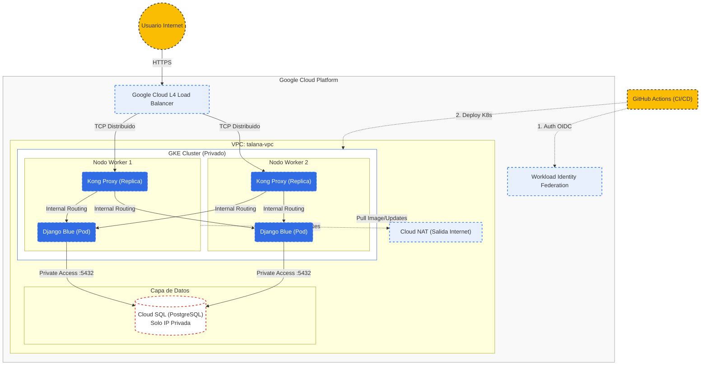

# Talana SRE Challenge

Infraestructura completa en Google Cloud Platform para desplegar una aplicacion Django en Kubernetes usando GitOps con ArgoCD.

## Arquitectura



## Stack Tecnologico

| Componente | Tecnologia |
|------------|------------|
| Cloud | Google Cloud Platform |
| IaC | Terraform 1.6+ |
| Container Orchestration | GKE (Google Kubernetes Engine) |
| GitOps | ArgoCD |
| CI/CD | GitHub Actions + Workload Identity Federation |
| Secrets | External Secrets Operator + GCP Secret Manager |
| Base de Datos | Cloud SQL PostgreSQL 15 |
| Aplicacion | Django 5.0 + Gunicorn |
| Container Registry | Artifact Registry |

## Estructura del Proyecto

```
talana-sre-challenge/
├── .github/workflows/
│   ├── terraform.yml          # CI/CD para infraestructura
│   ├── build-push.yml         # CI/CD para aplicacion
│   └── argocd-bootstrap.yml   # Setup inicial de ArgoCD
├── app/                       # Aplicacion Django
│   ├── Dockerfile
│   ├── requirements.txt
│   ├── manage.py
│   ├── talana/               # Proyecto Django
│   └── health/               # App de healthchecks
├── infra/                    # Terraform (IaC)
│   ├── provider.tf
│   ├── vpc.tf
│   ├── gke.tf
│   ├── database.tf
│   ├── argocd.tf
│   ├── artifact-registry.tf
│   └── secrets.tf
├── k8s/                      # Manifiestos Kubernetes (Kustomize)
│   ├── apps/
│   │   └── talana-backend/
│   │       ├── base/
│   │       └── overlays/dev/
│   ├── infra/
│   │   └── external-secrets/
│   └── argocd/
├── scripts/
│   └── bootstrap.sh          # Script de setup inicial
└── docs/
    ├── 01-bootstrap.md
    └── 02-argocd.md
```

## Quick Start

### Prerequisitos

- [Google Cloud SDK](https://cloud.google.com/sdk/docs/install)
- [Terraform](https://developer.hashicorp.com/terraform/downloads) >= 1.6
- Cuenta de GCP con billing habilitado
- Repositorio en GitHub

### Paso 1: Bootstrap del Proyecto

El script de bootstrap configura todo el proyecto de GCP desde cero:

```bash
# Clonar el repositorio
git clone https://github.com/jesbensevi/talana-sre-ch.git
cd talana-sre-ch

# Ejecutar bootstrap
./scripts/bootstrap.sh <PROJECT_ID> <GITHUB_REPO>

# Ejemplo:
./scripts/bootstrap.sh talana-sre-challenge-jesben jesbensevi/talana-sre-ch
```

**El script automatiza:**
- Creacion/seleccion del proyecto GCP
- Habilitacion de APIs necesarias
- Creacion del bucket para Terraform state
- Service Account para GitHub Actions
- Workload Identity Federation (autenticacion sin keys)

### Paso 2: Configurar GitHub Secrets

Despues de ejecutar el bootstrap, agrega estos secrets en GitHub:

| Secret | Descripcion |
|--------|-------------|
| `GCP_PROJECT_ID` | ID del proyecto GCP |
| `GCP_WORKLOAD_IDENTITY_PROVIDER` | Path del WIF provider |
| `GCP_SERVICE_ACCOUNT` | Email del Service Account |

Configurar en: `Settings > Secrets and variables > Actions`

### Paso 3: Deploy de Infraestructura

```bash
# Push a main para aplicar Terraform
git push origin main
```

GitHub Actions ejecutara automaticamente:
- `terraform plan` en PRs
- `terraform apply` en push a main

### Paso 4: Bootstrap de ArgoCD (Una sola vez)

Una vez que la infraestructura este desplegada, ejecutar el workflow de ArgoCD:

1. Ir a **Actions** en GitHub
2. Seleccionar **"ArgoCD Bootstrap"**
3. Click en **"Run workflow"**
4. Seleccionar action: **"apply"**

Este paso registra las aplicaciones en ArgoCD para que comience el despliegue GitOps.

## Flujo CI/CD

```
┌─────────────────────────────────────────────────────────────────┐
│                        CAMBIOS EN CODIGO                        │
└─────────────────────────────────────────────────────────────────┘
                               │
          ┌────────────────────┼────────────────────┐
          │                    │                    │
          ▼                    ▼                    ▼
    ┌──────────┐         ┌──────────┐         ┌──────────┐
    │ infra/** │         │  app/**  │         │  k8s/**  │
    └────┬─────┘         └────┬─────┘         └────┬─────┘
         │                    │                    │
         ▼                    ▼                    ▼
┌─────────────────┐  ┌─────────────────┐  ┌─────────────────┐
│ terraform.yml   │  │ build-push.yml  │  │     ArgoCD      │
│                 │  │                 │  │   (auto-sync)   │
│ Plan → Apply    │  │ Build → Push    │  │                 │
└────────┬────────┘  └────────┬────────┘  └────────┬────────┘
         │                    │                    │
         ▼                    ▼                    ▼
┌─────────────────┐  ┌─────────────────┐  ┌─────────────────┐
│   GCP Infra     │  │Artifact Registry│  │   GKE Cluster   │
│   Updated       │  │  Image Pushed   │  │    Deployed     │
└─────────────────┘  └─────────────────┘  └─────────────────┘
```

## Endpoints de la Aplicacion

| Endpoint | Descripcion |
|----------|-------------|
| `/` | Info del API |
| `/healthcheck` | Liveness probe |
| `/db-check` | Readiness probe + conexion BD |

## Acceso a ArgoCD

```bash
# Obtener IP externa
kubectl -n argocd get svc argocd-server

# Obtener password de admin
kubectl -n argocd get secret argocd-initial-admin-secret \
    -o jsonpath='{.data.password}' | base64 -d; echo
```

- **URL**: `http://<EXTERNAL-IP>`
- **Usuario**: `admin`
- **Password**: (obtenido con el comando anterior)

## Documentacion Adicional

- [01 - Bootstrap Guide](docs/01-bootstrap.md)
- [02 - ArgoCD Guide](docs/02-argocd.md)

## Roles IAM del Service Account

| Rol | Proposito |
|-----|-----------|
| `roles/editor` | Recursos generales de GCP |
| `roles/iam.serviceAccountTokenCreator` | Generar tokens |
| `roles/iam.serviceAccountAdmin` | Gestionar Service Accounts |
| `roles/servicenetworking.networksAdmin` | VPC peering |
| `roles/secretmanager.admin` | Secret Manager |
| `roles/container.admin` | GKE + RBAC |
| `roles/artifactregistry.admin` | Artifact Registry |

## Recursos Creados

### Networking
- VPC con subnet privada (10.10.0.0/24)
- Cloud NAT para salida a internet
- Private Service Connection para Cloud SQL

### Compute
- GKE Cluster privado (2 nodos e2-standard-2)
- Workload Identity habilitado

### Data
- Cloud SQL PostgreSQL 15 (IP privada)
- Secret Manager para credenciales

### CI/CD
- Artifact Registry para imagenes Docker
- Workload Identity Federation para GitHub Actions

---

**Talana SRE Challenge** - Infrastructure as Code + GitOps
