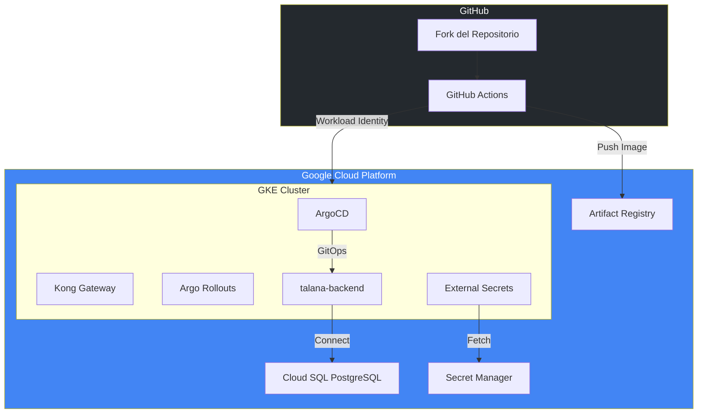
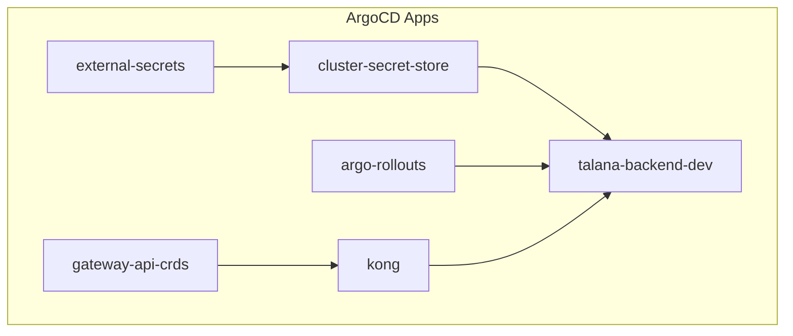

# Guia de Setup Completa

Esta guia permite desplegar toda la infraestructura del challenge en un nuevo proyecto de GCP desde cero.

## Arquitectura a Desplegar



---

## Fase 1: Prerrequisitos

### 1.1 Herramientas Requeridas

Instalar las siguientes herramientas:

| Herramienta | Version | Instalacion |
|-------------|---------|-------------|
| Google Cloud SDK | Latest | [Instrucciones](https://cloud.google.com/sdk/docs/install) |
| Terraform | >= 1.6 | [Instrucciones](https://developer.hashicorp.com/terraform/downloads) |
| kubectl | Latest | Incluido en gcloud SDK |
| Git | Latest | [Instrucciones](https://git-scm.com/downloads) |

**macOS (con Homebrew):**
```bash
# Google Cloud SDK
brew install --cask google-cloud-sdk

# Terraform
brew install terraform

# kubectl (via gcloud)
gcloud components install kubectl
gcloud components install gke-gcloud-auth-plugin
```

**Verificar instalacion:**
```bash
gcloud version
terraform version
kubectl version --client
```

### 1.2 Cuenta de GCP

Requisitos:
- Cuenta de Google Cloud Platform
- Billing habilitado (se requiere tarjeta de credito)
- Permisos de Owner o Editor en el proyecto

**Costo estimado del challenge:** ~$2-5 USD/dia (usando recursos minimos)

### 1.3 Cuenta de GitHub

- Cuenta de GitHub activa
- Permisos para crear repositorios y configurar secrets

---

## Fase 2: Preparar el Repositorio

### 2.1 Fork del Repositorio

1. Ir a: https://github.com/jesbensevi/talana-sre-challenge
2. Click en **Fork** (esquina superior derecha)
3. Seleccionar tu cuenta como destino
4. Esperar a que se complete el fork

### 2.2 Clonar el Repositorio

```bash
# Reemplazar <TU-USUARIO> con tu usuario de GitHub
git clone https://github.com/<TU-USUARIO>/talana-sre-challenge.git
cd talana-sre-challenge
```

### 2.3 Configurar Environment en GitHub

1. Ir a tu repositorio en GitHub
2. **Settings** → **Environments** → **New environment**
3. Nombre: `prod`
4. Click **Configure environment**
5. (Opcional) Agregar protection rules si deseas

---

## Fase 3: Bootstrap de GCP

### 3.1 Autenticarse en GCP

```bash
# Login interactivo
gcloud auth login

# Verificar autenticacion
gcloud auth list
```

### 3.2 Ejecutar Script de Bootstrap

El script automatiza toda la configuracion inicial de GCP:

```bash
# Dar permisos de ejecucion
chmod +x scripts/bootstrap.sh

# Ejecutar bootstrap
# Reemplazar:
#   - <TU-PROJECT-ID>: Un ID unico para tu proyecto (ej: mi-talana-challenge-123)
#   - <TU-USUARIO>: Tu usuario de GitHub

./scripts/bootstrap.sh <TU-PROJECT-ID> <TU-USUARIO>/talana-sre-challenge
```

**Ejemplo:**
```bash
./scripts/bootstrap.sh talana-challenge-juan juanperez/talana-sre-challenge
```

### 3.3 Que hace el Bootstrap


El script crea:
- Proyecto GCP (si no existe)
- Bucket para Terraform state
- Service Account para GitHub Actions
- Workload Identity Federation (autenticacion sin keys)

### 3.4 Guardar los Outputs

Al finalizar, el script muestra 3 valores importantes. **Guardalos:**

```
GCP_PROJECT_ID: tu-project-id
GCP_WORKLOAD_IDENTITY_PROVIDER: projects/123456/locations/global/workloadIdentityPools/...
GCP_SERVICE_ACCOUNT: github-actions-sa@tu-project-id.iam.gserviceaccount.com
```

---

## Fase 4: Configurar GitHub Secrets

### 4.1 Agregar Secrets

1. Ir a tu repositorio en GitHub
2. **Settings** → **Secrets and variables** → **Actions**
3. Click **New repository secret** para cada uno:

| Secret Name | Valor |
|-------------|-------|
| `GCP_PROJECT_ID` | El PROJECT_ID del bootstrap |
| `GCP_WORKLOAD_IDENTITY_PROVIDER` | El path completo del WIF provider |
| `GCP_SERVICE_ACCOUNT` | El email del Service Account |

### 4.2 Verificar Secrets

Deberias ver 3 secrets configurados:

```
GCP_PROJECT_ID          Updated just now
GCP_WORKLOAD_IDENTITY_PROVIDER   Updated just now
GCP_SERVICE_ACCOUNT     Updated just now
```

---

## Fase 5: Actualizar Configuracion

### 5.1 Actualizar backend.tf

Editar `infra/backend.tf` con tu bucket:

```hcl
terraform {
  backend "gcs" {
    bucket = "<TU-PROJECT-ID>-tfstate"  # Cambiar esto
    prefix = "terraform/state"
  }
}
```

### 5.2 Actualizar terraform.tfvars

Editar `infra/terraform.tfvars`:

```hcl
project_id = "<TU-PROJECT-ID>"  # Cambiar esto
region     = "us-east1"
```

### 5.3 Actualizar referencias del repositorio

Buscar y reemplazar en los siguientes archivos:

**k8s/argocd/dev-env.yaml:**
```yaml
source:
  repoURL: https://github.com/<TU-USUARIO>/talana-sre-challenge.git  # Cambiar
```

**k8s/argocd/cluster-secret-store.yaml:**
```yaml
source:
  repoURL: https://github.com/<TU-USUARIO>/talana-sre-challenge.git  # Cambiar
```

**k8s/argocd/argo-rollouts-dashboard.yaml:** (si existe)
```yaml
source:
  repoURL: https://github.com/<TU-USUARIO>/talana-sre-challenge.git  # Cambiar
```

### 5.4 Actualizar ClusterSecretStore

Editar `k8s/infra/cluster-secret-store/cluster-secret-store.yaml`:

```yaml
spec:
  provider:
    gcpsm:
      projectID: <TU-PROJECT-ID>  # Cambiar esto
```

### 5.5 Commit y Push

```bash
git add -A
git commit -m "chore: configure project for deployment"
git push origin main
```

---

## Fase 6: Desplegar Infraestructura

### 6.1 Ejecutar Terraform (Automatico)

El push a `main` dispara automaticamente el workflow de Terraform.

1. Ir a **Actions** en tu repositorio
2. Ver el workflow **"Terraform"** ejecutandose
3. Esperar a que complete (~15-20 minutos)

### 6.2 Verificar Despliegue

El workflow debe mostrar:
- `terraform plan` exitoso
- `terraform apply` exitoso

**Recursos creados:**
- VPC con subnet privada
- GKE Cluster (2 nodos)
- Cloud SQL PostgreSQL
- Artifact Registry
- Secret Manager secrets
- ArgoCD instalado

### 6.3 Conectarse al Cluster

```bash
# Configurar kubectl
gcloud container clusters get-credentials talana-gke-cluster \
    --zone us-east1-b \
    --project <TU-PROJECT-ID>

# Verificar conexion
kubectl get nodes
```

---

## Fase 7: Bootstrap de ArgoCD

### 7.1 Ejecutar Workflow

1. Ir a **Actions** en tu repositorio
2. Seleccionar **"ArgoCD Bootstrap"**
3. Click **"Run workflow"**
4. Seleccionar branch: `main`
5. Action: `apply`
6. Click **"Run workflow"**

### 7.2 Que despliega ArgoCD



### 7.3 Verificar ArgoCD

```bash
# Ver aplicaciones
kubectl get applications -n argocd

# Esperar a que todas esten "Synced" y "Healthy"
watch kubectl get applications -n argocd
```

---

## Fase 8: Obtener URLs de Acceso

### 8.1 ArgoCD UI

```bash
# Obtener IP
kubectl -n argocd get svc argocd-server -o jsonpath='{.status.loadBalancer.ingress[0].ip}'

# Obtener password
kubectl -n argocd get secret argocd-initial-admin-secret \
    -o jsonpath='{.data.password}' | base64 -d; echo
```

**Acceso:**
- URL: `http://<IP-ARGOCD>`
- Usuario: `admin`
- Password: (el obtenido arriba)

### 8.2 Kong API Gateway

```bash
kubectl -n kong get svc kong-kong-proxy -o jsonpath='{.status.loadBalancer.ingress[0].ip}'
```

**Probar la aplicacion:**
```bash
KONG_IP=$(kubectl -n kong get svc kong-kong-proxy -o jsonpath='{.status.loadBalancer.ingress[0].ip}')

# Root
curl http://$KONG_IP/

# Health check
curl http://$KONG_IP/health

# Ready check (incluye DB)
curl http://$KONG_IP/ready
```

### 8.3 Argo Rollouts Dashboard

```bash
kubectl -n argo-rollouts get svc argo-rollouts-dashboard -o jsonpath='{.status.loadBalancer.ingress[0].ip}'
```

**Acceso:**
- URL: `http://<IP-ROLLOUTS>:3100`

---

## Fase 9: Verificacion Final

### 9.1 Checklist

- [ ] ArgoCD UI accesible
- [ ] Todas las apps en ArgoCD "Synced" y "Healthy"
- [ ] `curl http://<KONG_IP>/health` retorna `{"status": "healthy"}`
- [ ] `curl http://<KONG_IP>/ready` retorna `{"status": "ready", "database": "connected"}`
- [ ] Rollouts Dashboard accesible

### 9.2 Ver Estado de la Aplicacion

```bash
# Pods
kubectl get pods -n talana-dev

# Rollout status
kubectl get rollout -n talana-dev

# Services
kubectl get svc -n talana-dev
```

---

## Fase 10: Probar Canary Deployment

### 10.1 Hacer un Cambio en la App

Editar `app/api/views.py` y cambiar la version:

```python
logger = logging.getLogger(__name__)
POD_NAME = socket.gethostname()
VERSION = '1.0.10' #cambiar versión a 2.0.0

```

### 10.2 Push del Cambio

```bash
git add -A
git commit -m "feat: bump version to 2.0.0"
git push origin main
```

### 10.3 Observar el Canary

1. Ir al **Argo Rollouts Dashboard**
2. Ver el progreso del canary: 10% → 30% → 50% → 100%
3. O via CLI:
   ```bash
   kubectl get rollout talana-backend -n talana-dev -w
   ```

---

## Troubleshooting

### Terraform falla con permisos

```bash
# Verificar que el Service Account tenga los roles correctos
gcloud projects get-iam-policy <TU-PROJECT-ID> \
    --flatten="bindings[].members" \
    --filter="bindings.members:github-actions-sa@"
```

### ArgoCD apps no sincronizan

```bash
# Ver logs del application controller
kubectl logs -n argocd -l app.kubernetes.io/name=argocd-application-controller

# Verificar conectividad al repo
kubectl get applications -n argocd -o yaml | grep -A5 "status:"
```

### Kong no responde

```bash
# Ver pods
kubectl get pods -n kong

# Ver logs
kubectl logs -n kong -l app.kubernetes.io/name=kong
```

### Base de datos no conecta

```bash
# Verificar External Secret
kubectl get externalsecret -n talana-dev

# Verificar Secret creado
kubectl get secret db-credentials-k8s -n talana-dev
```

---

## Limpieza (Opcional)

Para eliminar todos los recursos:

### Eliminar recursos de Kubernetes

```bash
# Via ArgoCD Bootstrap workflow con action "delete"
# O manualmente:
kubectl delete -k k8s/argocd/
```

### Eliminar infraestructura

```bash
cd infra
terraform destroy
```

### Eliminar proyecto GCP (borra todo)

```bash
gcloud projects delete <TU-PROJECT-ID>
```

---

## Resumen de URLs

Una vez desplegado, tendras acceso a:

| Servicio | URL | Credenciales |
|----------|-----|--------------|
| ArgoCD UI | `http://<IP>` | admin / (ver kubectl) |
| Kong API | `http://<IP>` | - |
| Rollouts Dashboard | `http://<IP>:3100` | - |
| App Health | `http://<KONG_IP>/health` | - |
| App Ready | `http://<KONG_IP>/ready` | - |

---

## Contacto

Si tienes problemas con el setup, revisa:
1. Los logs de GitHub Actions
2. Los logs de ArgoCD
3. El estado de los pods en cada namespace

**Repositorio original:** https://github.com/jesbensevi/talana-sre-challenge
