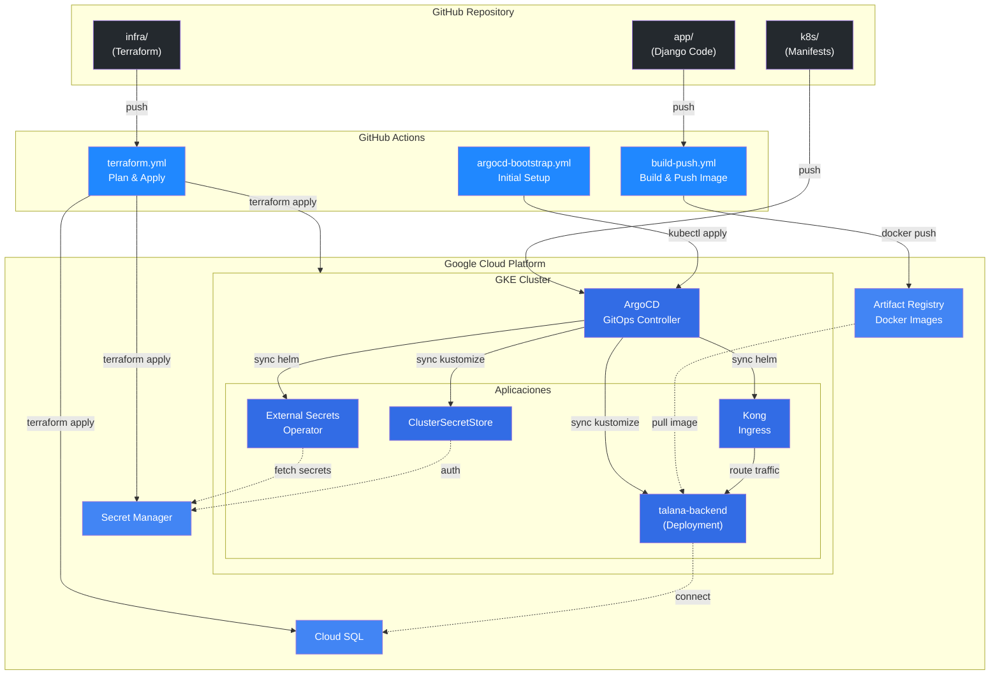
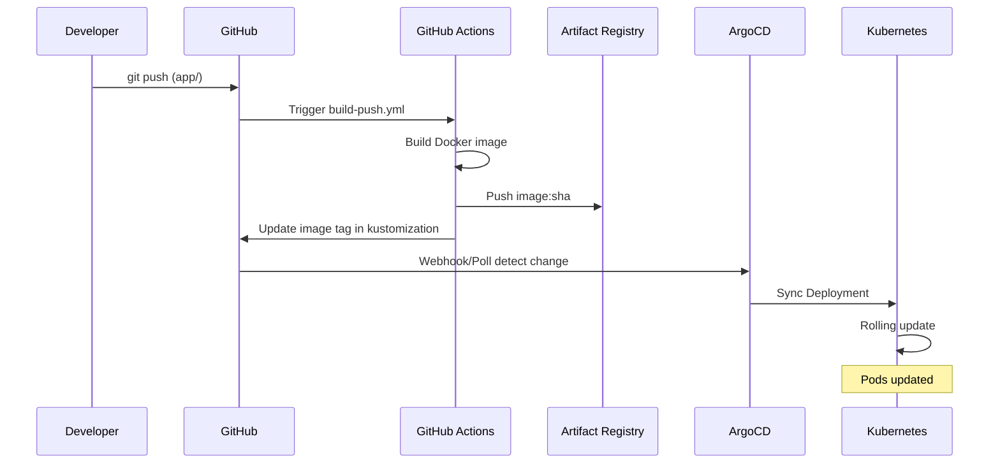
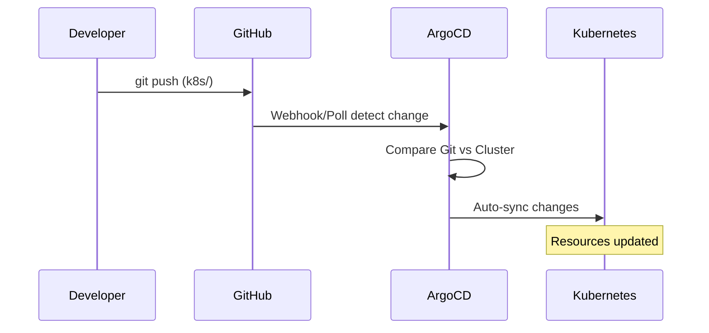
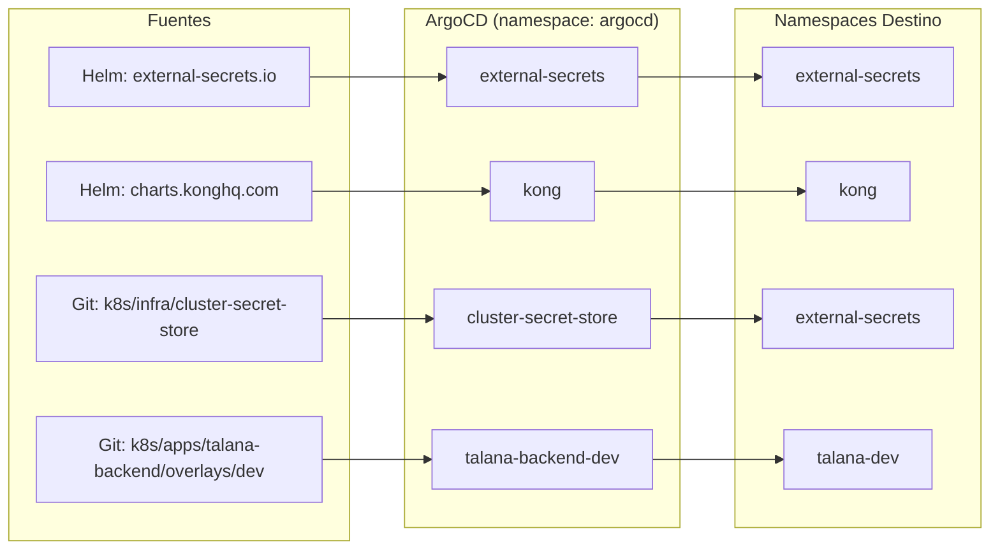
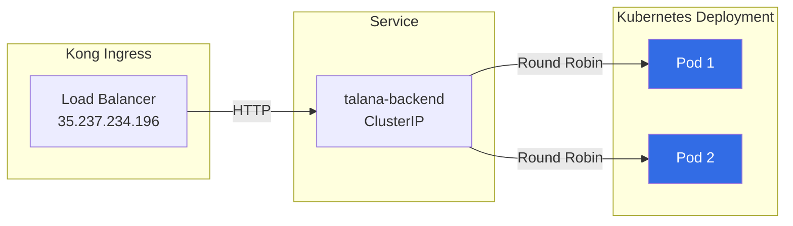

# Arquitectura GitOps

Este documento describe el flujo GitOps completo del proyecto.

## Diagrama General



## Flujo por Tipo de Cambio

### 1. Cambios en Aplicacion (app/)



### 2. Cambios en Infraestructura (infra/)


### 3. Cambios en Manifiestos K8s (k8s/)



## ArgoCD Applications



## Estructura de Directorios

```
talana-sre-challenge/
├── .github/workflows/
│   ├── terraform.yml        ──→ Cambios en infra/
│   ├── build-push.yml       ──→ Cambios en app/
│   └── argocd-bootstrap.yml ──→ Manual (una vez)
│
├── app/                     ──→ GitHub Actions (build-push)
│   ├── Dockerfile
│   └── ...
│
├── infra/                   ──→ GitHub Actions (terraform)
│   ├── *.tf
│   └── ...
│
└── k8s/                     ──→ ArgoCD (auto-sync)
    ├── argocd/              ──→ Bootstrap inicial
    │   ├── kong.yaml
    │   ├── infra.yaml
    │   ├── cluster-secret-store.yaml
    │   └── dev-env.yaml
    │
    ├── apps/
    │   └── talana-backend/
    │       ├── base/        ──→ Recursos comunes
    │       └── overlays/
    │           └── dev/     ──→ Configuracion dev
    │
    └── infra/
        ├── external-secrets/
        └── cluster-secret-store/
```

## Deployment Flow



## Webhook para Sync Instantaneo

ArgoCD esta configurado con un **webhook de GitHub** para sync instantaneo en lugar del polling por defecto (3 minutos).

```
GitHub Push → Webhook → ArgoCD → Sync (segundos)
```

**Configuracion:** GitHub repo → Settings → Webhooks

| Campo | Valor |
|-------|-------|
| Payload URL | `http://<ARGOCD_IP>/api/webhook` |
| Content type | `application/json` |
| Events | Just the push event |

El webhook notifica a todas las aplicaciones de ArgoCD. Solo se sincronizan las apps cuyos paths fueron modificados.

## Resumen de Automatizaciones

| Trigger | Pipeline | Accion |
|---------|----------|--------|
| Push a `app/**` | build-push.yml | Build image → Push → Update tag |
| Push a `infra/**` | terraform.yml | Plan → Apply |
| Push a `k8s/**` | ArgoCD | Auto-sync a cluster |
| Manual | argocd-bootstrap.yml | Aplicar apps ArgoCD |

## Enlaces Utiles

- **ArgoCD UI**: http://34.26.252.189
- **Kong API**: http://35.237.234.196
- **Artifact Registry**: us-east1-docker.pkg.dev/talana-sre-challenge-jesben/talana-repo
