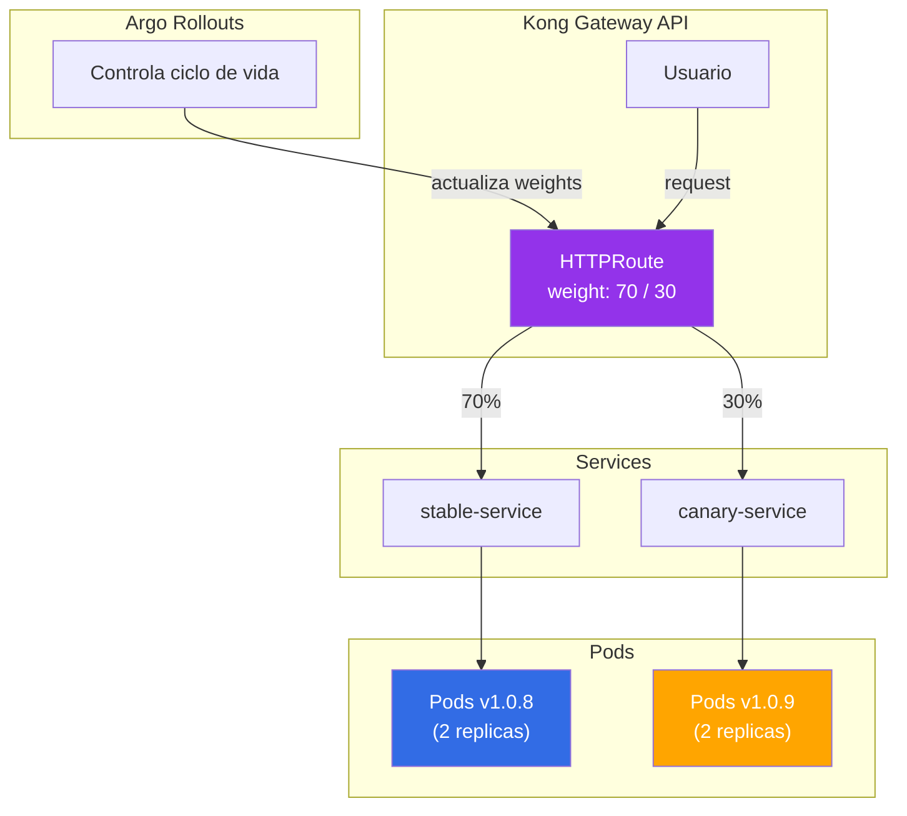
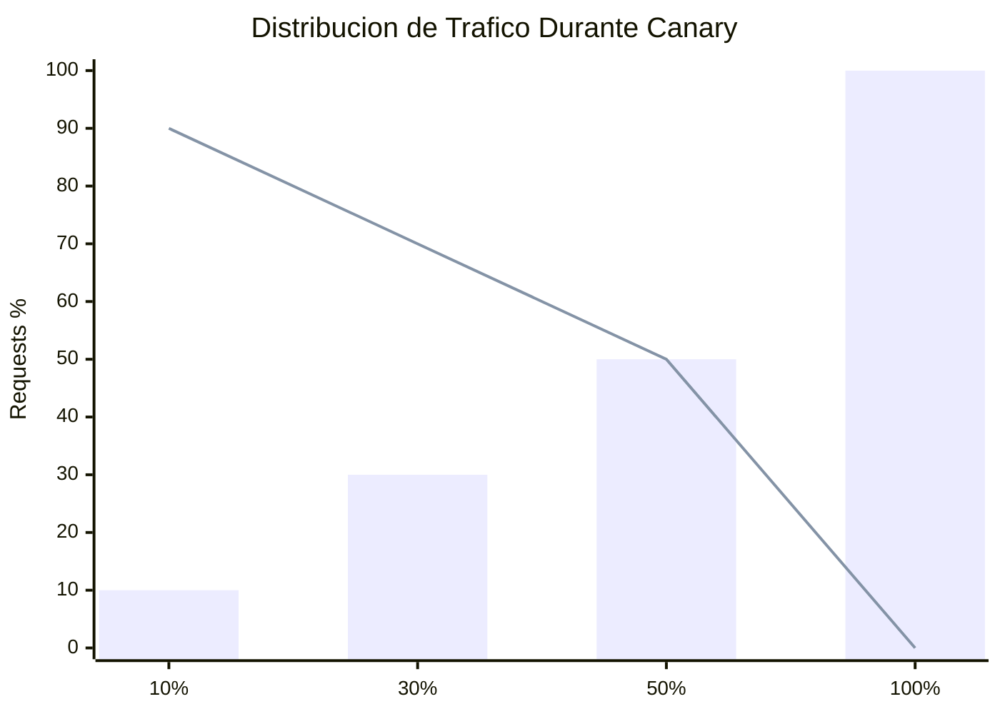
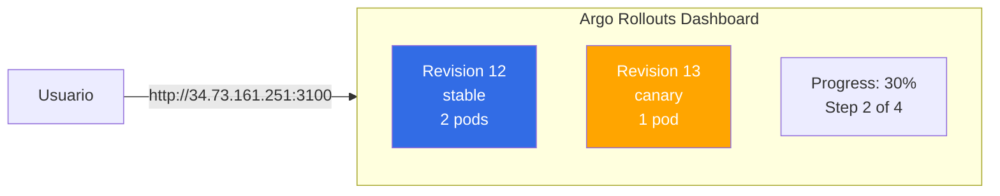

# Canary Deployments con Argo Rollouts

Este documento describe como funcionan los deployments canary usando Argo Rollouts con Gateway API para control preciso del trafico.

## Arquitectura



## Componentes

### 1. Rollout (en lugar de Deployment)

```yaml
apiVersion: argoproj.io/v1alpha1
kind: Rollout
metadata:
  name: talana-backend
spec:
  replicas: 2
  selector:
    matchLabels:
      app: talana-backend
  template:
    # ... pod template
  strategy:
    canary:
      canaryService: talana-backend-canary
      stableService: talana-backend-stable
      trafficRouting:
        plugins:
          argoproj-labs/gatewayAPI:
            httpRoute: talana-backend
            namespace: talana-dev
      steps:
        - setWeight: 10
        - pause: {duration: 1m}
        - setWeight: 30
        - pause: {duration: 1m}
        - setWeight: 50
        - pause: {duration: 2m}
        - setWeight: 100
```

### 2. Services (stable y canary)

```yaml
apiVersion: v1
kind: Service
metadata:
  name: talana-backend-stable
spec:
  selector:
    app: talana-backend
  ports:
    - port: 80
      targetPort: 8000
---
apiVersion: v1
kind: Service
metadata:
  name: talana-backend-canary
spec:
  selector:
    app: talana-backend
  ports:
    - port: 80
      targetPort: 8000
```

### 3. HTTPRoute (Gateway API)

```yaml
apiVersion: gateway.networking.k8s.io/v1
kind: HTTPRoute
metadata:
  name: talana-backend
spec:
  parentRefs:
    - name: kong-gateway
  rules:
    - matches:
        - path:
            type: PathPrefix
            value: /
      backendRefs:
        - name: talana-backend-stable
          port: 80
          weight: 100  # Argo Rollouts modifica este valor
        - name: talana-backend-canary
          port: 80
          weight: 0    # Argo Rollouts modifica este valor
```

## Flujo de un Canary Deployment

### Paso 1: Nueva imagen detectada

```
GitHub Actions → Push nueva imagen → Update kustomization.yaml
ArgoCD → Detecta cambio → Sync Rollout
```

### Paso 2: Canary inicia

```
Rollout crea nuevos pods con la nueva imagen
HTTPRoute: stable=100%, canary=0%
```

### Paso 3: Progresion automatica

| Tiempo | Stable | Canary | Estado |
|--------|--------|--------|--------|
| 0:00 | 100% | 0% | Inicio |
| 0:01 | 90% | 10% | Step 1 |
| 1:01 | 70% | 30% | Step 2 |
| 2:01 | 50% | 50% | Step 3 |
| 4:01 | 0% | 100% | Promocion |

### Paso 4: Promocion completa

```
Pods canary → se convierten en stable
Pods stable antiguos → terminados
HTTPRoute: stable=100%, canary=0%
```

## Comandos Utiles

### Ver estado del Rollout

```bash
# Estado general
kubectl get rollout -n talana-dev

# Estado detallado
kubectl describe rollout talana-backend -n talana-dev

# Ver paso actual
kubectl get rollout talana-backend -n talana-dev -o jsonpath='{.status.currentStepIndex}'
```

### Ver distribucion de trafico

```bash
# Ver pesos en HTTPRoute
kubectl get httproute talana-backend -n talana-dev -o jsonpath='{.spec.rules[0].backendRefs}' | jq .

# Test de distribucion real
KONG_IP=$(kubectl -n kong get svc kong-kong-proxy -o jsonpath='{.status.loadBalancer.ingress[0].ip}')
for i in {1..20}; do
  curl -s http://$KONG_IP/health | jq -r '.version'
done | sort | uniq -c
```

### Ejemplo Real de Canary en Progreso

Durante un canary deployment de v1.0.9 → v1.0.10, asi se ve la distribucion de trafico:

```bash
# Step 1: 10% canary
$ for i in {1..20}; do curl -s http://35.237.234.196/health | jq -r '.version'; done | sort | uniq -c
   2 1.0.10
  18 1.0.9

# Step 3: 50% canary
$ for i in {1..20}; do curl -s http://35.237.234.196/health | jq -r '.version'; done | sort | uniq -c
  10 1.0.10
  10 1.0.9

# Step 4: 100% canary (promocion completa)
$ for i in {1..20}; do curl -s http://35.237.234.196/health | jq -r '.version'; done | sort | uniq -c
  20 1.0.10
```



| Step | Canary (nueva) | Stable (anterior) | Pausa |
|------|----------------|-------------------|-------|
| 1 | 10% | 90% | 1 min |
| 2 | 30% | 70% | 1 min |
| 3 | 50% | 50% | 2 min |
| 4 | 100% | 0% | - |

### Monitorear progreso en tiempo real

```bash
# Watch del rollout
kubectl get rollout talana-backend -n talana-dev -w

# Watch de pods
kubectl get pods -n talana-dev -w

# Ver logs del controller
kubectl logs -n argo-rollouts -l app.kubernetes.io/name=argo-rollouts -f
```

## Operaciones Manuales

### Pausar un Canary

```bash
kubectl argo rollouts pause talana-backend -n talana-dev
```

### Resumir un Canary pausado

```bash
kubectl argo rollouts resume talana-backend -n talana-dev
```

### Promover inmediatamente (skip pauses)

```bash
kubectl argo rollouts promote talana-backend -n talana-dev
```

### Abortar y hacer Rollback

```bash
kubectl argo rollouts abort talana-backend -n talana-dev
```

### Reintentar un rollout fallido

```bash
kubectl argo rollouts retry rollout talana-backend -n talana-dev
```

## Dashboard de Argo Rollouts

Argo Rollouts incluye un dashboard web para visualizar el estado de los rollouts en tiempo real.

### Acceso al Dashboard

El dashboard esta expuesto via LoadBalancer:

| Servicio | URL |
|----------|-----|
| Argo Rollouts Dashboard | http://34.73.161.251:3100 |

### Alternativa: Port Forward (desarrollo local)

```bash
# Acceder al dashboard via port-forward
kubectl port-forward svc/argo-rollouts-dashboard 3100:3100 -n argo-rollouts

# Abrir en navegador: http://localhost:3100
```

### Vista del Dashboard



## Configuracion en ArgoCD

Para que ArgoCD no revierta los cambios de weights que hace Argo Rollouts, se configura `ignoreDifferences`:

```yaml
# k8s/argocd/dev-env.yaml
apiVersion: argoproj.io/v1alpha1
kind: Application
metadata:
  name: talana-backend-dev
spec:
  # ...
  ignoreDifferences:
    - group: argoproj.io
      kind: Rollout
      jsonPointers:
        - /spec/replicas
    - group: gateway.networking.k8s.io
      kind: HTTPRoute
      jqPathExpressions:
        - .spec.rules[].backendRefs[].weight
```

## Plugin de Gateway API

El plugin se instala en Argo Rollouts mediante la configuracion del Helm chart:

```yaml
# k8s/argocd/argo-rollouts.yaml
helm:
  valuesObject:
    controller:
      trafficRouterPlugins:
        - name: "argoproj-labs/gatewayAPI"
          location: "https://github.com/argoproj-labs/rollouts-plugin-trafficrouter-gatewayapi/releases/download/v0.4.0/gatewayapi-plugin-linux-amd64"
```

## Troubleshooting

### Canary no progresa

```bash
# Ver eventos del rollout
kubectl describe rollout talana-backend -n talana-dev | tail -30

# Ver logs del controller
kubectl logs -n argo-rollouts -l app.kubernetes.io/name=argo-rollouts --tail=50
```

### HTTPRoute weights no cambian

1. Verificar que el plugin este instalado:
```bash
kubectl get cm -n argo-rollouts argo-rollouts-config -o yaml
```

2. Verificar que ArgoCD tenga `ignoreDifferences` configurado

3. Ver logs del rollouts controller:
```bash
kubectl logs -n argo-rollouts deploy/argo-rollouts --tail=100
```

### Pods canary no reciben trafico

```bash
# Verificar que los servicios apunten a los pods correctos
kubectl get endpoints -n talana-dev

# Verificar labels de los pods
kubectl get pods -n talana-dev --show-labels
```

## Archivos Relacionados

| Archivo | Descripcion |
|---------|-------------|
| `k8s/argocd/argo-rollouts.yaml` | ArgoCD app para Argo Rollouts |
| `k8s/apps/talana-backend/base/rollout.yaml` | Definicion del Rollout |
| `k8s/apps/talana-backend/base/services.yaml` | Services stable y canary |
| `k8s/apps/talana-backend/base/httproute.yaml` | HTTPRoute para routing |
| `k8s/argocd/dev-env.yaml` | ignoreDifferences config |

---

Ver [04-kong.md](04-kong.md) para configuracion de Kong Gateway API.
Ver [05-gitops-architecture.md](05-gitops-architecture.md) para el flujo GitOps completo.
