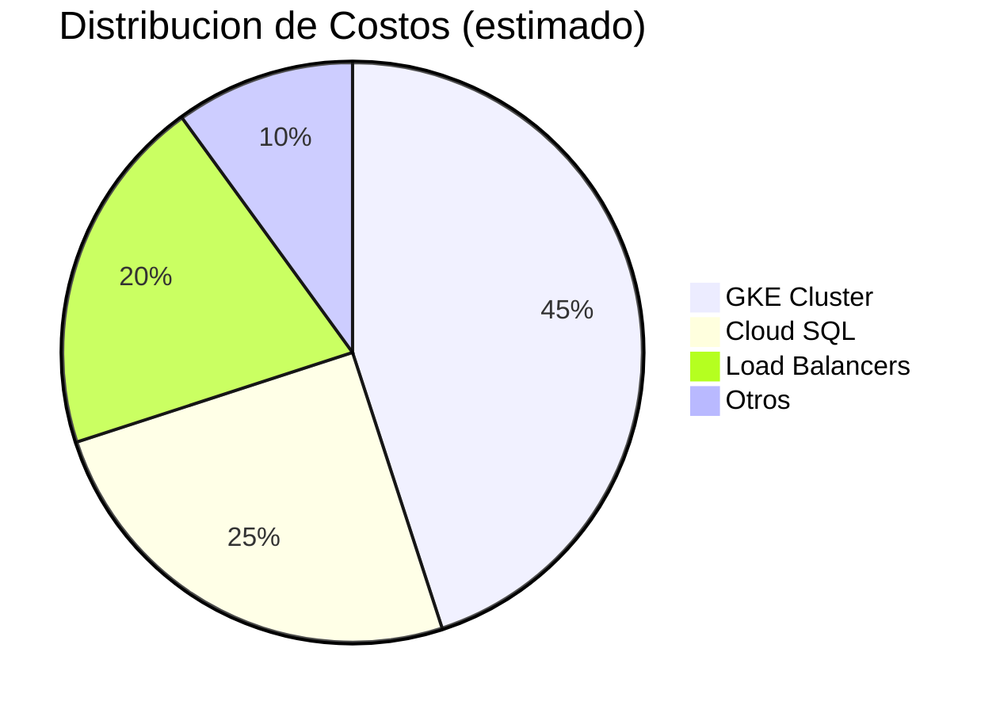

# Costos y Billing

Estimacion de costos para ejecutar este challenge en Google Cloud Platform.

## Resumen de Costos



## Costo Estimado Diario

| Recurso | Especificacion | Costo/Dia |
|---------|----------------|-----------|
| GKE Cluster | 2x e2-standard-2 (preemptible) | ~$1.50 |
| Cloud SQL | db-f1-micro | ~$0.50 |
| Load Balancers | 3x Regional L4 | ~$0.60 |
| Cloud NAT | 1 gateway | ~$0.10 |
| Artifact Registry | Storage minimo | ~$0.01 |
| Secret Manager | 5 secrets | ~$0.01 |
| **Total Estimado** | | **~$2.70/dia** |

**Costo mensual estimado:** ~$80 USD (si se deja corriendo 24/7)

## Desglose por Servicio

### GKE Cluster

> **Referencia:** [GKE Pricing](https://cloud.google.com/kubernetes-engine/pricing) | [VM Instance Pricing](https://cloud.google.com/compute/vm-instance-pricing)

```
Nodos: 2x e2-standard-2 (preemptible/spot)
- 2 vCPU, 8 GB RAM cada uno
- On-demand: ~$0.067/hora (~$48.92/mes)
- Preemptible/Spot: 60-91% descuento (~$0.02/hora)
- Costo diario (2 nodos spot): ~$1.00-1.50

Management fee: $0.10/hora por cluster
- Costo diario: ~$2.40
- Free tier: $74.40/mes en creditos (1 cluster zonal gratis)
```

### Cloud SQL

> **Referencia:** [Cloud SQL Pricing](https://cloud.google.com/sql/pricing)

```
Instancia: db-f1-micro
- Shared CPU, 0.6 GB RAM
- Costo estimado: ~$10/mes para workloads ligeros
- Nota: No cubierto por SLA (shared CPU)

Storage: 10 GB HDD
- Costo: ~$0.09/GB-mes (HDD)
- ~$0.17/GB-mes (SSD)
```

### Load Balancers

> **Referencia:** [Cloud Load Balancing Pricing](https://cloud.google.com/load-balancing/pricing) | [Network Pricing](https://cloud.google.com/vpc/network-pricing)

```
3 Load Balancers L4 (TCP/UDP):
- Primeras 5 forwarding rules: $0.025/hora (total, no por regla)
- Reglas adicionales (6+): $0.01/hora cada una
- Costo diario (3 LBs separados): ~$1.80

Trafico procesado:
- Varia por region
- Sin cargos globales de procesamiento
```

### Cloud NAT

> **Referencia:** [Cloud NAT Pricing](https://cloud.google.com/nat/pricing)

```
1 NAT Gateway:
- Costo base: ~$0.045/hora
- Costo diario: ~$1.00

Trafico procesado:
- $0.045/GB (egress)
```

## Tips para Minimizar Costos

### 1. Usar Nodos Preemptible/Spot

Ya configurado en el challenge:
```hcl
# infra/gke.tf
preemptible = true  # 60-80% mas barato
```

### 2. Escalar a Cero cuando no uses

```bash
# Reducir nodos a 0
gcloud container clusters resize talana-gke-cluster \
    --node-pool talana-node-pool \
    --num-nodes 0 \
    --zone us-east1-b

# Restaurar a 2 nodos
gcloud container clusters resize talana-gke-cluster \
    --node-pool talana-node-pool \
    --num-nodes 2 \
    --zone us-east1-b
```

### 3. Detener Cloud SQL

```bash
# Detener instancia (no elimina datos)
gcloud sql instances patch talana-db --activation-policy=NEVER

# Iniciar instancia
gcloud sql instances patch talana-db --activation-policy=ALWAYS
```

### 4. Eliminar Recursos al Terminar

Ver seccion "Limpieza" al final.

## Monitorear Costos

### Via Consola GCP

1. Ir a: https://console.cloud.google.com/billing
2. Seleccionar tu cuenta de billing
3. Ver **Reports** para desglose detallado

### Configurar Alertas de Presupuesto

```bash
# Crear alerta cuando llegue al 50% y 90% de $50
gcloud billing budgets create \
    --billing-account=<BILLING_ACCOUNT_ID> \
    --display-name="Talana Challenge Budget" \
    --budget-amount=50USD \
    --threshold-rule=percent=0.5 \
    --threshold-rule=percent=0.9
```

### Via CLI

```bash
# Ver costos del proyecto
gcloud billing projects describe <PROJECT_ID>
```

## Free Tier y Creditos

### GCP Free Tier (siempre gratis)

- 1 instancia e2-micro (no aplica a e2-standard)
- 5 GB de storage en Artifact Registry
- 10,000 operaciones de Secret Manager/mes

### Creditos para Nuevas Cuentas

- $300 USD en creditos por 90 dias
- Suficiente para ~3 meses del challenge

### Verificar Creditos Restantes

```bash
gcloud billing accounts list
# Ver creditos en: https://console.cloud.google.com/billing
```

## Limpieza Completa

Para evitar costos continuos, eliminar todos los recursos:

### Opcion 1: Eliminar via Terraform (recomendado)

```bash
cd infra
terraform destroy -auto-approve
```

### Opcion 2: Eliminar Proyecto Completo

```bash
# Esto elimina TODO el proyecto y sus recursos
gcloud projects delete <PROJECT_ID>
```

### Opcion 3: Eliminar Recursos Individuales

```bash
# Eliminar cluster GKE
gcloud container clusters delete talana-gke-cluster \
    --zone us-east1-b --quiet

# Eliminar Cloud SQL
gcloud sql instances delete talana-db --quiet

# Eliminar VPC (despues de eliminar GKE)
gcloud compute networks delete talana-vpc --quiet
```

## Comparativa: Challenge vs Produccion

| Aspecto | Challenge | Produccion |
|---------|-----------|------------|
| GKE Nodos | 2 preemptible | 3+ on-demand |
| Cloud SQL | db-f1-micro | db-custom-2-4096 + HA |
| Load Balancers | 3 L4 | 1 L7 (consolida) |
| **Costo/mes** | ~$80 | ~$500+ |

## Recursos Adicionales

### Documentacion Oficial de Precios

| Servicio | Link |
|----------|------|
| Calculadora de Precios | [cloud.google.com/products/calculator](https://cloud.google.com/products/calculator) |
| GKE Pricing | [cloud.google.com/kubernetes-engine/pricing](https://cloud.google.com/kubernetes-engine/pricing) |
| Compute Engine (VMs) | [cloud.google.com/compute/vm-instance-pricing](https://cloud.google.com/compute/vm-instance-pricing) |
| Spot VMs Pricing | [cloud.google.com/compute/vm-instance-pricing#spot](https://cloud.google.com/compute/vm-instance-pricing#spot_pricing) |
| Cloud SQL Pricing | [cloud.google.com/sql/pricing](https://cloud.google.com/sql/pricing) |
| Load Balancing Pricing | [cloud.google.com/load-balancing/pricing](https://cloud.google.com/load-balancing/pricing) |
| Network Pricing | [cloud.google.com/vpc/network-pricing](https://cloud.google.com/vpc/network-pricing) |
| Cloud NAT Pricing | [cloud.google.com/nat/pricing](https://cloud.google.com/nat/pricing) |
| Secret Manager Pricing | [cloud.google.com/secret-manager/pricing](https://cloud.google.com/secret-manager/pricing) |
| Artifact Registry Pricing | [cloud.google.com/artifact-registry/pricing](https://cloud.google.com/artifact-registry/pricing) |

> **Nota:** Los precios varian por region y pueden cambiar. Siempre verifica la documentacion oficial para obtener los precios actuales.
